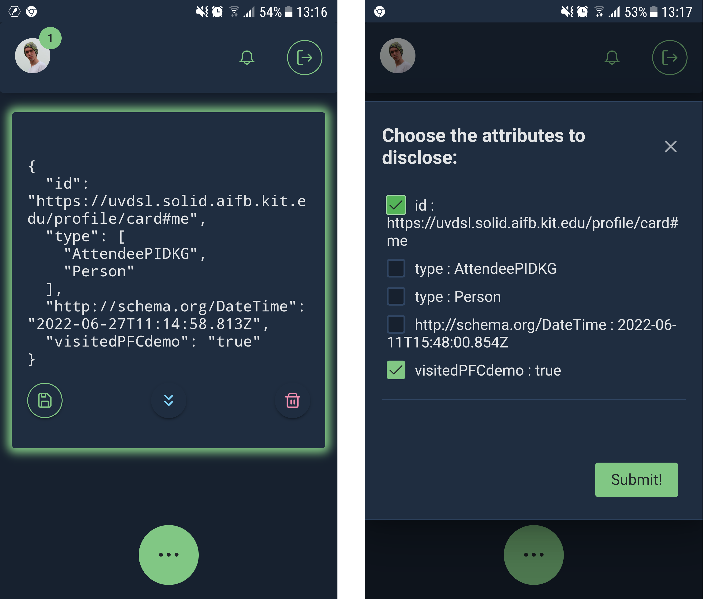

# Solid VC PWA

This Prgressive Web Application is a demo for [Verifiable Credentials](https://www.w3.org/TR/vc-data-model/) with [Selective Disclosure](https://www.w3.org/TR/vc-data-model/#dfn-selective-disclosure) to enhance the access control of [Solid](https://solidproject.org).


## Gotcha!
- The service worker is disabled in development mode (> npm run serve).
- To test the service worker locally, you have to build the app (> npm run build) and then serve it locally via some webserver. I use my Solid Pod for that.
- Firefox does not support installing PWAs.
- Safari does not support Web Push Notifications. Certainly not on iOS, and I could not verify it on macOS. Let me know!

## .env
See the [.env.example](./.env.example) for configuring the path of the application to be served from.

## Build and run using Docker
```
docker build -t solid-vc-pwa:latest .
docker run -d -p 8080:80 --name SOLID-VC-PWA solid-vc-pwa:latest
```

## Project setup
```
npm install
```

### Compiles and hot-reloads for development
```
npm run serve
```

## Screenshots

  

